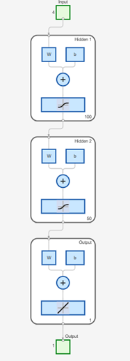
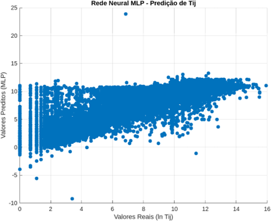
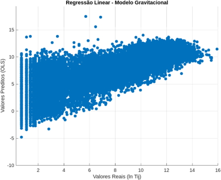

# **ANÁLISE PREDITIVA DA DINÂMICA LOGÍSTICA DO CAFÉ NO BRASIL POR MEIO DE MODELOS GRAVITACIONAIS E REDES NEURAIS DO TIPO MLP**

**Resumo.** O presente trabalho avalia a capacidade preditiva do Modelo Gravitacional (MG) e de uma Rede Neural Artificial (RNA) do tipo Multi Layer Perceptron (MLP) na estimativa dos fluxos de transporte 
de café dos municípios brasileiros para portos e aeroportos de exportação. A metodologia envolveu a extração de dados públicos de exportação do Ministério do Desenvolvimento, Indústria, Comércio e Serviços (MDIC), 
o cálculo de variáveis explicativas como produção, destino, distância e valor Free on Board (FOB), além da criação de variáveis numéricas a partir de variáveis categóricas que representam características logísticas. 
Os modelos foram treinados e avaliados utilizando métricas como coeficiente de determinação (R²) e erro absoluto médio (MAE) avaliando seu resultado com e sem as variáveis categóricas. Os resultados demonstram que a rede MLP supera o MG em desempenho preditivo. 
A inclusão de variáveis categóricas também contribuiu positivamente para a acurácia dos modelos, indicando assim o potencial das redes neurais como ferramentas eficazes na gestão da logística do agronegócio brasileiro.

**Palavras-chave:** Logística, Transporte, Café, Previsão

## **1.	INTRODUÇÃO**

O café é um dos pilares do agronegócio brasileiro, exercendo papel fundamental na economia nacional desde o período colonial até os dias atuais. O país é, historicamente, o maior produtor e exportador mundial da bebida, sendo responsável por aproximadamente um terço da produção global (Embrapa, 2013). De acordo com Maliszewski (2020) tal protagonismo não se restringe ao aspecto econômico, mas também envolve dimensões sociais, culturais e territoriais, uma vez que a cafeicultura está presente em centenas de municípios e sustenta milhões de trabalhadores ao longo de sua cadeia produtiva, como também aponta o IBGE (2023).
Diante dessa relevância, a eficiência logística na cadeia do café assume papel estratégico, especialmente no que tange ao escoamento da produção dos municípios do interior até os portos e aeroportos de exportação. A previsão precisa do fluxo de cargas permite otimizar custos, reduzir desperdícios, melhorar a infraestrutura de transporte e subsidiar políticas públicas voltadas à competitividade. Nesse contexto, modelos matemáticos e computacionais capazes de simular e prever os trajetos mais prováveis e os volumes transportados tornam-se ferramentas valiosas para produtores, exportadores, operadores logísticos e órgãos governamentais. Um dos modelos clássicos utilizados para representar fluxos comerciais e de transporte é o Modelo Gravitacional (MG), cuja formulação teórica é inspirada na Lei da Gravitação Universal de Newton. De acordo com Ribeiro (2023) o MG é uma abordagem matemática utilizada para estimar o volume de viagens entre duas zonas geográficas. Esse modelo pressupõe que a quantidade de viagens entre uma zona de origem e uma zona de destino é proporcional ao "peso" ou "massa" dessas zonas, representadas, por exemplo, pela população, empregos ou atividade econômica e inversamente proporcional ao custo de deslocamento entre elas, como tempo, distância ou custo monetário. A fórmula básica do modelo é dada pela notação: 

          Fij = G . (Mi^α .Mj^β) / (Dij^τ)

Em que, *Fij* é a variável dependente que se deseja prever, como o número de viagens entre as zonas *i* e *j* ou a carga a ser transportada; *Mi* representa a produção de viagens na origem; *Mj* a atração de viagens no destino; *Dij* é a impedância entre *i* e *j* e *G* é a constante gravitacional. Ribeiro (2023) demonstra que no campo da economia e da geografia, esse modelo tem sido aplicado para explicar a intensidade de fluxos entre duas regiões como função direta da “massa” econômica (geralmente, produção e consumo) e inversa da distância entre elas. No caso do transporte de café, o modelo permite estimar a quantidade de carga movimentada entre os municípios produtores e os pontos de exportação, a partir de variáveis como o volume produzido, o volume recebido pelo destino e a distância geográfica entre os dois pontos.
Embora o modelo gravitacional apresente simplicidade e poder explicativo razoável, ele é limitado em capturar relações complexas e não lineares entre as variáveis envolvidas, especialmente em cadeias logísticas altamente dinâmicas como as do café. Tais limitações motivam a busca por métodos mais flexíveis e com maior poder preditivo, como os modelos de Inteligência Artificial (IA), em especial as Redes Neurais Artificiais (RNA). Segundo Silva, Spatti & Flauzino (2024) as RNAs têm demonstrado eficácia em diversas tarefas de predição e classificação, devido à sua capacidade de modelar relações não lineares e interações complexas entre variáveis. Além disso, trabalhos como o de Morland, Tandetzki e Schier (2025) demonstrou a superioridade das RNAs em tarefas de predição comparadas com o MG.
Esse estudo é baseado no trabalho de Gonçalves, da Silva e d’Agosto (2015) e propõe uma comparação entre o desempenho do modelo gravitacional tradicional e uma RNA do tipo Multi Layer Perceptron (MLP) na tarefa de prever os fluxos de transporte de café dos municípios produtores brasileiros para os portos e aeroportos de exportação. Na seção 2 é apresentada a metodologia do trabalho, abordando a construção do dataset, bem como treinamento e arquitetura dos modelos, variáveis utilizadas e demais configurações. Na seção 3 apresentamos e discutimos os resultados obtidos e, por fim, expomos as conclusões. 

## **2. MATERIAIS E MÉTODOS**

Foi empregue uma abordagem quantitativa e comparativa para modelar o fluxo de transporte de café entre municípios produtores brasileiros e os principais portos e aeroportos utilizados para exportação. A metodologia abrangeu as seguintes etapas: coleta de dados, preparação e integração dos dados, transformação de variáveis, cálculo de distâncias geográficas, construção das variáveis explicativas, modelagem estatística e das redes neurais, e análise comparativa de desempenho.

### 2.1	Origem, coleta e preparação dos dados	

Os dados foram obtidos no site do Ministério do Desenvolvimento, Indústria, Comércio e Serviços (MDIC) – em estatísticas de comércio exterior em dados abertos. Os dados baixados estavam divididos em dois datasets: o primeiro a base de dados detalhada por Nomenclatura Comum do Mercosul (NCM) e o segundo a base de dados detalhada por município da empresa exportadora/importadora e posição do Sistema Harmonizado (SH4), abrangendo o período de 1997 a 2025 e contemplando todas as exportações registradas nesse intervalo. 
Tanto os códigos NCM quanto SH4 são utilizados na classificação de mercadorias no comércio internacional e com base nos códigos específicos do café, foi possível filtrar apenas as exportações relacionadas a essa commodities, excluindo os demais produtos irrelevantes para essa pesquisa.
Ambos os conjuntos de dados apresentavam colunas comuns, como: data, país de destino, peso total em quilogramas, porto ou aeroporto de despacho e valor Free on Board (FOB). No entanto, enquanto o primeiro dataset informava o destino final da carga, o segundo indicava o porto ou aeroporto de destino. Para identificar as rotas de exportação (do município produtor até o porto ou aeroporto de despacho), foi utilizada a função merge da biblioteca Pandas em Python, a partir das colunas comuns entre os dois conjuntos. Ao final do processo de fusão, obteve-se um dataset consolidado com 56.769 registros, contendo as seguintes variáveis: data, município produtor, porto ou aeroporto de despacho, país de destino, total em quilogramas e valor FOB da carga.

### 2.2 Criação das variáveis

A criação das variáveis foi feita a partir do MG, onde primeiro, com auxílio da biblioteca Pandas do Python, somou-se toda a produção (em KG) de cada município. Da mesma forma, foi somado todo o valor recebido por cada porto ou aeroporto, criando assim duas novas colunas no dataset: Total produzido pelo município e total recebido pelo porto/aeroporto. Como impedância foi adotada a distância entre o município e o local de despacho. Para cálculo da distância (em Km) usou-se a versão gratuita da API Location IQ.  Outra variável adicionada foi o valor FOB, que representa a responsabilidade do comprador ou vendedor sobre a carga. Por fim, para linearizar as distribuições e atender às premissas da regressão, todas as variáveis quantitativas foram transformadas utilizando o logaritmo natural, em outras palavras, a fórmula do MG que até então era não linear, torna-se linear assumindo:

          ln(1 + F_ij) = α + β1 ln Mi + β2  ln FOB + β3 ln Mj + γ ln Dij

Para lidar com observações nulas no fluxo  *Fij*, optou-se por utilizar a transformação 
ln(1 + *Fij*) como variável dependente. Essa modificação evita a exclusão de pares origem-destino com ausência de transporte, preservando a completude do banco de dados e reduzindo distorções estatísticas nos resultados. Uma vez que a equação se deu por mínimos quadrados ordinários, é preciso certificar que os logs não contenham valores zerados ou negativos. Trabalhos como o de Farias & Hidalgo (2012) defendem essa abordagem ao citar pesquisas de predição através do MG que adotaram a mesma metodologia. Contudo, há de se observar ainda a necessidade de os erros serem homocedásticos e não auto correlacionados, como aponta Hoffmann (2016). 
Na condução do estudo foram criadas três variáveis numéricas a partir de variáveis categóricas, também conhecidas como dummies: sendo elas: ‘mesma_UF’ assumindo valor 1 quando o porto de exportação está no mesmo estado da federação do município produtor e 0 caso contrário. ‘Porto_santos’ onde valor 1 indica quando o porto de exportação é o Porto de Santos (já que esse recebe o maior volume nacional) e 0 para os demais portos e aeroportos e a terceira variável ‘alta_produção’ para indicar municípios com produção total de café acima da média nacional dado pela fórmula: (Mi > média (Mi)), sendo 1 para os municípios acima da média e 0 para os demais. 
O modelo foi calculado com e sem utilização dessas variáveis, a fim de se testar o impacto de sua inserção. Desse modo as variáveis de entrada utilizadas estão definidas e exibidas na Tabela 1.

*Lista de variáveis de entrada e saída*

- ln_Fij: Variável a ser predita                          
- ln_Mi: Valor total produzido pelo município            
- ln_Mj: Valor total recebido pelo porto                 
- ln_Dij: Distância entre o município e o porto/aeroporto 
- ln_FOB: Valor pago pela carga                           
- d_POR: Se o porto de destino é o porto de Santos       
- d_MUF: Origem e destino na mesma UF                    
- d_ALT: Municípios com alta produção                    

### 2.3 Treinamento e execução do MG e da RNA

O MG e a RNA do tipo MLP tiveram sua arquitetura e treinamento realizados com auxílio da ferramenta MATLAB. Para a MLP foram testadas diferentes arquiteturas de rede, variando entre uma e três camadas ocultas, com número de neurônios por camada entre 50 e 100. Foi adotada a configuração com menor erro médio absoluto (MAE), sendo a mesma estrutura utilizada tanto para o cálculo com e sem as variáveis dummies. Os dados foram divididos em 70% para treino, 15% para teste e 15% para validação.  A Figura 1 exibe a arquitetura completa da rede utilizada. A primeira camada oculta conta com 100 neurônios, cada um ativado por uma função sigmoide que transforma a combinação linear das entradas em um valor entre 0 e 1, o que é útil para introduzir não linearidade na rede e ajudar na aprendizagem de padrões complexos. Na sequência, a segunda camada oculta é composta por 50 neurônios, também ativados por uma função sigmoide. 
Por fim, a camada de saída é dotada de função de ativação linear, ou seja, a saída da rede é dada diretamente pela combinação ponderada das ativações da segunda camada, sem aplicação de não linearidade. Essa escolha é particularmente apropriada quando a tarefa exige previsões em escala contínua e irrestrita, como é o caso de modelos preditivos de quantidades, como apontado por Goodfellow et. al (2016).

*Arquitetura da MLP com duas camadas intermediárias (hidden layers) a primeira com 100 neurônios e a segunda com 50, ambas ativadas pela função sigmoide a qual transforma as entradas em valores contínuos entre 0 e 1, introduzindo não linearidade ao modelo. Por fim, a camada de saída conta com um único neurônio ativado por uma função linear, adequada para tarefas de regressão, pois permite que os valores de saída assumam qualquer valor contínuo ao longo do eixo real.*

## **3. RESULTADOS**

A avaliação comparativa entre o MG e a rede MLP foi conduzida em dois cenários distintos, sendo: a) sem a inclusão das variáveis categóricas dummies, considerando apenas variáveis quantitativas transformadas em logaritmo natural; e b) com a inclusão das dummies representando características logísticas específicas. Os indicadores de desempenho considerados foram o coeficiente de determinação (R²) e MAE. Na Tabela 2 temos o comparativo geral entre os modelos.

Tabela 2 – Comparativo Modelo Gravitacional e MLP
| Modelo                  | R² s/ dummies | R² c/ dummies | MAE s/ dummies | MAE c/ dummies |
|:------------------------|:------------:|:------------:|:-------------:|:-------------:|
| Modelo Gravitacional     | 0,6850       | 0,6891       | 1,3906        | 1,3718        |
| MLP                      | 0,8520       | 0,8543       | 0,9101        | 0,8996        |

A rede neural MLP teve um desempenho ligeiramente melhor, superando o MG com uma diferença positiva no R² de 0,17 e MAE inferior em 0,48. Esse resultado demonstra a capacidade das RNAs em modelar relações não lineares, o que para essa aplicação permite uma melhor aproximação dos volumes reais transportados. É notável também que a inclusão das três dummies melhorou ambos os modelos com ganho de R² e diminuição do MAE, isso reforça o quanto a inserção de variáveis categóricas relacionadas a variável dependente pode influenciar o modelo de forma positiva.
Analisando graficamente os desempenhos do MG e da MLP (Fig. 2) através dos valores reais e preditos por cada modelo, observa-se que o modelo MLP apresenta uma distribuição de pontos mais próxima da diagonal ideal, indicando maior aderência às observações reais. Além disso, há menor dispersão, especialmente para valores intermediários e altos, reforçando a superioridade do modelo na captura de padrões complexos. Embora ambos os modelos apresentem outliers e valores negativos esparsos, a MLP demonstrou ser mais robusta e precisa na tarefa de predição, o que se alinha aos indicadores quantitativos de desempenho apresentados anteriormente (R² e MAE).

*Comparativo MLP vs. MG com valores reais. A MLP apresenta uma área (pontos azuis) mais achatada do que o MG. No entanto, é possível observar a presença de outliers (pontos azuis distantes da área central).*

## **4. CONSIDERAÇÕES FINAIS**

Conclui-se que a aplicação de uma RNA do tipo MLP permitiu ganhos substanciais de desempenho preditivo, com R² superior a 0.85 e redução consistente do MAE. Tais resultados indicam que modelos baseados em IA podem ser mais apropriados para lidar com a complexidade da logística do café no Brasil, que envolve variáveis econômicas, geográficas e estruturais interdependentes. A inclusão de variáveis categóricas contribuiu marginalmente para a melhora de ambos os modelos, demonstrando que também ainda há espaço para melhorias com a inserção de novas variáveis.
Esses achados têm importantes implicações práticas: redes neurais podem ser utilizadas como ferramentas de apoio à tomada de decisão na gestão de cadeias logísticas do agronegócio, contribuindo para o planejamento de infraestrutura, redução de custos com transporte, otimização de rotas e identificação de gargalos logísticos. Além disso, é possível conjecturar que a aplicação deste método possa ser estendida a outras commodities e setores produtivos, embora essa hipótese ainda precise ser confirmada por estudos futuros. Como sugestões para novas pesquisas, recomenda-se a inclusão de dados meteorológicos, sazonais, macroeconômicos como variáveis adicionais nos modelos e a comparação com outras arquiteturas de IA, como árvores de decisão, XGBoost ou LSTM para séries temporais.	

## **REFERÊNCIAS**

- BRASIL, Ministério do Desenvolvimento, Indústria, Comércio e Serviços. (2025), *Base de dados bruta – Estatísticas de Comércio Exterior*. Disponível em: https://www.gov.br/mdic/pt-br/assuntos/comercio-exterior/estatisticas/base-de-dados-bruta. Acesso em: 8 jun. 2025.
- de Farias, J. J., Hidalgo, A. B. (2012), *Comércio interestadual e comércio internacional das regiões brasileiras: Uma análise utilizando o modelo gravitacional.* Revista Econômica Do Nordeste, 43(2), 251–266. https://doi.org/10.61673/ren.2012.211.
- Embrapa. (2013), *Um terço do café consumido no mundo é produzido no Brasil.* Disponível em: https://www.embrapa.br/busca-de-noticias/-/noticia/1472642/um-terco-do-cafe-consumido-no-mundo-e-produzido-no-brasil. Acesso em 29 de jul de 2025.
- Gonçalves, D. N. S., da Silva, M. A & d’Agosto, M. A. (2015), *Procedimento para uso de Redes Neurais Artificiais no planejamento estratégico de fluxo de carga no Brasil.* The Journal of Transport Literature, 9(1), 45-49. DOI: http://dx.doi.org/10.1590/2238-1031.jtl.v9n1a9.
- Goodfellow, I.; Bengio, Y.; Courville, A. (2016), *Deep learning.* Cambridge: MIT Press.
- Hoffmann, R. (2016), *Análise de regressão: uma introdução à econometria* [recurso eletrônico] / Rodolfo Hoffmann. - - 5. ed. Piracicaba: O Autor, 2016. 393 p. : il.  DOI: https://doi.org/10.11606/9788592105709.
- IBGE. (2023), *Produção de Café no Brasil.* Disponível em: https://www.ibge.gov.br/explica/producao-agropecuaria/cafe/br. Acesso em 29 de jul de 2025.
- Maliszewski, E. (2020), *Café gera 8,4 milhões de empregos.* Agrolink. Disponível em: https://www.agrolink.com.br/noticias/cafe-gera-8-4-milhoes-de-empregos_437875.html. Acesso em: 31 jul. 2025.
- Morland, C.; Tandetzki, J.; Schier, F. (2025), *An evaluation of gravity models and artificial neuronal networks on bilateral trade flows in wood markets.* Forest Policy and Economics, [S.l.], v. 161, 2025. DOI: https://doi.org/10.1016/j.forpol.2025.103457.
- Ribeiro, S. (2023), *A importância do modelo gravitacional como instrumento do comércio internacional.* In: TOMÉ, Luís; VALENÇA PINTO, Luís; BRITTO, Brígida (orgs.). Em torno do pensamento de Luís Moita: Humanismo e Relações Internacionais. Lisboa: Universidade Autónoma de Lisboa‑OBSERVARE; ACD Print, 2023. p. 413–424. DOI: 10.26619/978-989-9002-28-9.30.
- Silva, I. N. da; Spatti, D. H.; Flauzino, R. A. (2016), *Redes Neurais Artificiais: Para Engenharia e Ciências Aplicadas*, 2º ed., Artliber, São Paulo.

